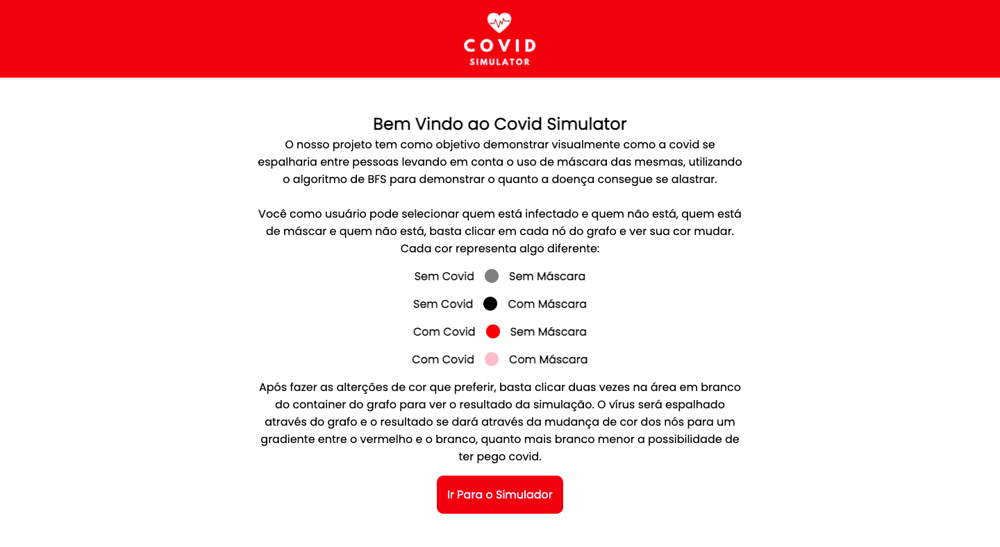
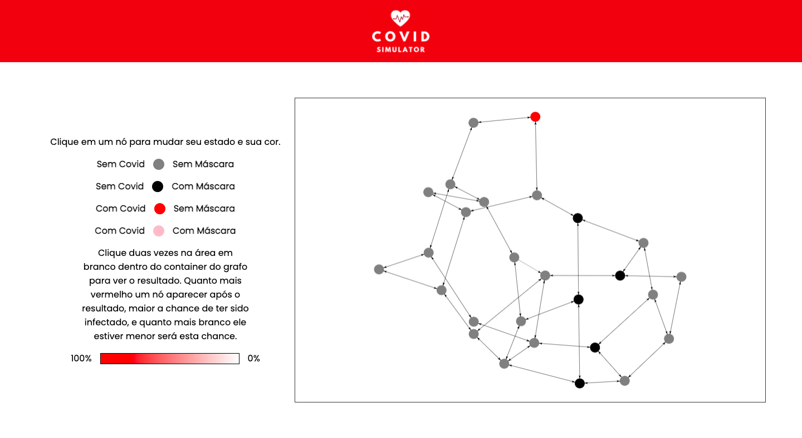
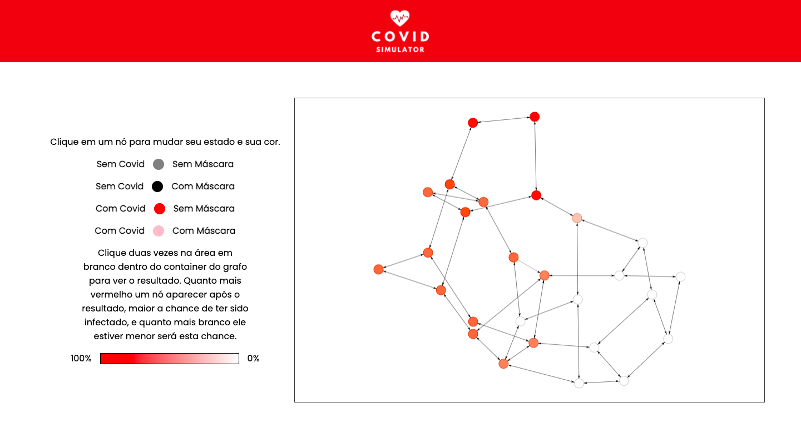

# CovidSimulator

**Conteúdo da Disciplina**: Grafos 1<br>

## Alunos
|Matrícula | Aluno |
| -- | -- |
| 18/0030345  |  Arthur Sena |
| 18/0033646  |  João Luis Baraky |

## Sobre 
O CovidSimulator tem como objetivo demonstrar visualmente como 
a covid se alastra dentro de um grupo e o quanto o uso de máscara
pode afetar esse processo atrasando e evitando a contaminação.

## Screenshots





## Instalação 
**Linguagem**: JavaScript<br>
**Framework**: React<br>
É necessário possuir o node instalado na máquina

## Uso 
```powershell
# Clone o repositório
git clone https://github.com/projeto-de-algoritmos/Grafos1_CovidSimulator.git

# Entre no diretório e instale as dependencias
cd Grafos1_CovidSimulator && npm install

# Inicie o projeto
npm start
```

Após rodar o projeto visite a porta 3000 no seu navegador,
dentro dela você encontrará uma página informativa sobre 
como prosseguir.

Dentro do simulador escolha quais nós do grafo que estarão infectados,
quais estarão usando máscara e rode a simulação (duplo clique no 
fundo branco do container do grafo), o resultado demonstrará as chances 
de infecção para cada nó os pintando num gradiente entre vermelho
e branco (mais vermelho maior a chance de infecção).